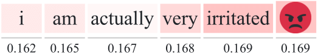
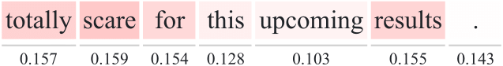
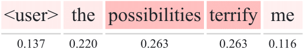
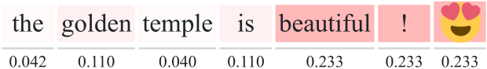
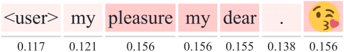
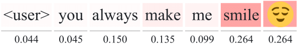
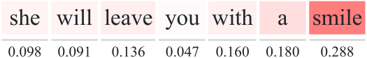

# NeAt-Vision

> NeAt (Neural Attention) Vision, is a visualization tool 
for the attention mechanisms of deep-learning models 
for Natural Language Processing (NLP) tasks.

#### Features
  - Visualize the attention scores, with lots of options.
  - Export the visualization to SVG format. This is very convenient if you
  want to use the visualization in an academic paper. However, you may have
  to convert the SVG to PDF.
  - Visualize the models predictions. Show the posterior distribution over the
  classes, the error in regression tasks and more. Useful for debugging your
  models and inspecting their behavior.
  - Support for classification, multilabel classification and regression.


_neat-vision_ is made for visualizing the weights of attention mechanisms 
for Natural Language Processing (Tasks) tasks.
At the moment, _neat-vision_ works only 
for self-attention mechanisms for sentence-level models.
However in the future there are plans for 
supporting document-level models (hierarchical) and seq2seq models, 
such as in Neural Machine Translation.


**Demo**: https://cbaziotis.github.io/neat-vision/

<p style="text-align:center;">

</p>


### Examples

<p>


</br>


</br>


</br>


</br>
</p>


## Documentation

### Overview
_neat-vision_ takes as input 2 kinds of `json` files:
 - **Data file**. This file contains  (1) the text (tokenized), 
      (2) the attention scores and (3) the models predictions.
 - **Label file** (optional). 
      This is needed only in classifications tasks 
      and if provided, it is used for mapping each class label 
      to a user-defined description.

At this moment, _neat-vision_ only supports the visualization of 
self-attention mechanisms, operating on the sentence-level 
and for the following tasks:
 - Regression: predict a single continuous value.
 - Multi-class Classification: a classification task with more than two classes.
  Each sample belongs to one of `N` classes.
 - Multi-label Classification: we have `N` classes 
   and each sample may belong to more than one classes.
   Essentially, it is a binary classification task for each class.  


### Input Format

Here you will find a detailed overview of 
how to properly format the output files, for each task.
Besides the necessary data needed for visualizing the attention weights,
in _neat-vision_ you can also visualise the predictions of the model
and gain insights in its behavior. However, it is not required that you provide
such data (e.g. posterior probabilities). 

In any case, in `\samples` you will find some examples, 
containing the predictions of our team (NTUA-SLP) in Semeval 2018. 
You can use them to test _neat-vision_ and to check the format of the data files.

**Notes**

 - the posteriors don't have to be normalized, which means you can simply
  use the logits (before the softmax). _neat-vision_ will normalize the logits
  for you. This is convenient for PyTorch users.
 - its ok to include the zero padded attention weights. 
  It simply matches each token with the corresponding attention weight, 
  so the zero padded timesteps in the attention weigths don't matter.   

#### Regression 
The structure of the data file for a classification task is the following:
```
{
    "text": [],       \\ list of strings - the tokens (words, chars) in the text. (required)
    "label": 0,       \\ float - the actual value. (required)
    "prediction": 0,  \\ float - the predicted value. (required)
    "attention": [],  \\ list of floats - the attention weigths. (required)
    "id": "sample_11" \\ string - a unique id assigned to each sample. (required)
  }
```

Here is an example of a sample in a data file:
```
{
    "text": [
      "i",
      "have",
      "never",
      "been",
      "so",
      "excited",
      "to",
      "start",
      "a",
      "semester",
      "!"
    ],
    "label": 0.969,
    "prediction": 0.8037105202674866,
    "attention": [
      0.030253062024712563,
      0.04317276179790497,
      0.12440750747919083,
      0.018600208684802055,
      0.023923002183437347,
      0.1299467384815216,
      0.1300467699766159,
      0.13003277778625488,
      0.1280088871717453,
      0.1151493638753891,
      0.12645892798900604,
      0.0,
      0.0,
      ...
      0.0,
      0.0
    ],
    "id": "sample_11"
  }
```


#### Classification 
The structure of the data file for a classification task is the following:
```
{
    "text": [],       \\ list of strings - the tokens (words, chars) in the text. (required)
    "label": 0,       \\ integer - the class label. (required)
    "prediction": 0,  \\ integer - the predicted label. (required)
    "posterior": [],  \\ list of floats - the posterior probabilities. (optional)
    "attention": [],  \\ list of floats - the attention weigths. (required)
    "id": "sample_99" \\ string - a unique id assigned to each sample. (required)
  }
```

Here is an example of a sample in a data file:
```
{
    "text": [
      "20",
      "episodes",
      "left",
      "i",
      "am",
      "dying",
      "over",
      "here"
    ],
    "label": 0,
    "prediction": 0,
    "posterior": [
      1.6511023044586182,
      0.6472567319869995,
      0.10215002298355103,
      -1.8493231534957886
    ],
    "attention": [
      0.026811618357896805,
      0.03429250791668892,
      0.16327856481075287,
      0.1225932389497757,
      0.14799638092517853,
      0.17938685417175293,
      0.15541180968284607,
      0.1702289879322052,
      0.0,
      0.0,
      ...
      0.0,
      0.0
    ],
    "id": "sample_99"
  }
```


#### Multilabel Classification 
The structure of the data file for a classification task is the following:
```
{
    "text": [],       \\ list of strings - the tokens (words, chars) in the text. (required)
    "label": 0,       \\ list of ints - the class labels - binary vector. (required)
    "prediction": 0,  \\ list of ints - the predicted labels - binary vector. (required)
    "posterior": [],  \\ list of floats - the posterior probabilities. (optional)
    "attention": [],  \\ list of floats - the attention weigths. (required)
    "id": "sample_55" \\ string - a unique id assigned to each sample. (required)
}
```

Here is an example of a sample in a data file:
```
{
    "text": [
      "<allcaps>",
      "fall",
      "season",
      "starts",
      "today",
      "</allcaps>",
      "!",
      "<repeated>"
    ],
    "label": [
      0,
      1,
      0,
      0,
      1,
      0,
      1,
      0,
      0,
      0,
      1
    ],
    "prediction": [
      0,
      1,
      0,
      0,
      1,
      0,
      0,
      0,
      0,
      0,
      0
    ],
    "posterior": [
      -2.388745069503784,
      0.4522533118724823,
      -3.0336408615112305,
      -2.2636921405792236,
      1.1948155164718628,
      -2.710108995437622,
      -0.09358435124158859,
      -3.7859573364257812,
      -3.229905605316162,
      -2.832045078277588,
      -2.1722922325134277
    ],
    "attention": [
      0.12348131835460663,
      0.12422706931829453,
      0.12277955561876297,
      0.14215923845767975,
      0.12141828238964081,
      0.12250666320323944,
      0.12207339704036713,
      0.12135452032089233,
      0.0,
      0.0,
      ...
      0.0,
      0.0
    ],
    "id": "sample_55"
  }
```

##### Labels
In classification tasks, you can optionally provide a mapping 
of each class label to a name and description. Here is such an example:
```json
{
  "0": {
    "name": "❤",
    "desc": "_red_heart_"
  },
  "1": {
    "name": "😍",
    "desc": "_smiling_face_with_hearteyes_"
  },
  "2": {
    "name": "😂",
    "desc": "_face_with_tears_of_joy_"
  },
  "3": {
    "name": "💕",
    "desc": "_two_hearts_"
  },
  "4": {
    "name": "🔥",
    "desc": "_fire_"
  },
  "5": {
    "name": "😊",
    "desc": "_smiling_face_with_smiling_eyes_"
  },
  "6": {
    "name": "😎",
    "desc": "_smiling_face_with_sunglasses_"
  },
  "7": {
    "name": "✨",
    "desc": "_sparkles_"
  },
  "8": {
    "name": "💙",
    "desc": "_blue_heart_"
  },
  "9": {
    "name": "😘",
    "desc": "_face_blowing_a_kiss_"
  },
  "10": {
    "name": "📷",
    "desc": "_camera_"
  },
  "11": {
    "name": "🇺🇸",
    "desc": "_United_States_"
  },
  "12": {
    "name": "☀",
    "desc": "_sun_"
  },
  "13": {
    "name": "💜",
    "desc": "_purple_heart_"
  },
  "14": {
    "name": "😉",
    "desc": "_winking_face_"
  },
  "15": {
    "name": "💯",
    "desc": "_hundred_points_"
  },
  "16": {
    "name": "😁",
    "desc": "_beaming_face_with_smiling_eyes_"
  },
  "17": {
    "name": "🎄",
    "desc": "_Christmas_tree_"
  },
  "18": {
    "name": "📸",
    "desc": "_camera_with_flash_"
  },
  "19": {
    "name": "😜",
    "desc": "_winking_face_with_tongue_"
  }
}
```


## Build Setup

``` bash
# install dependencies
npm install

# serve with hot reload at localhost:8080
npm run dev

# build for production with minification
npm run build

# build for production and view the bundle analyzer report
npm run build --report
```

For a detailed explanation on how things work, check out the [guide](http://vuejs-templates.github.io/webpack/) and [docs for vue-loader](http://vuejs.github.io/vue-loader).
